# Full Control-System Architecture

This diagram describes the reverse-capable controller implemented in
`Control/Reverse_test/AFO_control_reverse.py`,
`Control/Reverse_test/AFO_reverse.py`, and `Control/calibration.py`.

```mermaid
flowchart TD
    %% ---------- Hardware and ROS I/O ----------
    subgraph IO["1. Hardware and ROS interfaces"]
        lidar["RPLIDAR<br/>raw LaserScan: /scan"]
        filter["ROS laser filter<br/>Filter_leg.launch"]
        filtered["Filtered LaserScan<br/>/scan_legs_filtered"]
        encoders["Left + right magnetic encoders<br/>JointState: /encoder_data"]
        leftMotor["Left wheel motor"]
        rightMotor["Right wheel motor"]
        firmware["ESP32 motor firmware gate<br/>Bool: /shutdown"]

        lidar --> filter --> filtered
    end

    %% ---------- Acquisition ----------
    subgraph ACQ["2. ROS node: acquisition and scheduling"]
        scanArrival["LiDAR arrival callback<br/>update last_scan_update"]
        encoderArrival["Encoder arrival callback<br/>update last_encoder_update"]
        sync["ApproximateTimeSynchronizer<br/>queue = 20, slop = 0.10 s"]
        cache["Cache aligned<br/>LaserScan + JointState"]
        controlTimer["Control timer<br/>6 Hz"]
        motorTimer["Motor publisher timer<br/>30 Hz"]

        scanArrival --> sync
        encoderArrival --> sync
        sync --> cache
        cache --> controlTimer
    end

    filtered --> scanArrival
    encoders --> encoderArrival

    %% ---------- Control callback checks ----------
    subgraph CALLBACK["3. Control-loop callback"]
        inputsReady{"Cached scan and<br/>encoder available?"}
        skipTick["Skip this control tick"]
        encoderMean["Encoder feedback<br/>mean of left + right velocity"]
        polar["Convert valid polar returns to XY<br/>keep finite ranges from 0.25–2.0 m"]

        controlTimer --> inputsReady
        inputsReady -- No --> skipTick
        inputsReady -- Yes --> encoderMean --> polar
    end

    %% ---------- Perception ----------
    subgraph PERCEPTION["4. LiDAR leg perception"]
        points{"Any valid<br/>XY points?"}
        dbscan["DBSCAN<br/>eps = 0.04 m, min_samples = 3"]
        clusterCount{"Number of<br/>non-noise clusters"}
        two["Two clusters<br/>calculate both centroids<br/>reset occlusion counter"]
        oneWidth{"Single-cluster width<br/>greater than 0.30 m?"}
        split["Yes: split point array in half<br/>calculate two centroids"]
        reconstruct["No: mark occluded<br/>match visible centroid to prior legs<br/>reuse hidden leg position"]
        noisy[">2 clusters<br/>reuse previous two legs"]
        zeroLabels["No DBSCAN clusters<br/>mark occluded and reuse prior legs"]
        history{"Required previous<br/>leg positions exist?"}
        occlusionCount["Increment consecutive<br/>occlusion counter"]
        shutdownOcclusion{"Occlusion count<br/>at least 20?"}
        assign["Assign left/right by lateral Y<br/>store positions for next tick"]
        legsReady{"Usable left and<br/>right estimates?"}

        polar --> points
        points -- Yes --> dbscan --> clusterCount
        points -- No --> occlusionCount
        clusterCount -- "2" --> two --> assign
        clusterCount -- "1" --> oneWidth
        oneWidth -- Yes --> split --> assign
        oneWidth -- No --> history
        history -- Yes --> reconstruct --> occlusionCount
        history -- No --> skipTick
        clusterCount -- ">2" --> noisy --> history
        clusterCount -- "0" --> zeroLabels --> occlusionCount
        occlusionCount --> shutdownOcclusion
        shutdownOcclusion -- No --> legsReady
        assign --> legsReady
        legsReady -- No --> skipTick
    end

    %% ---------- Operator gate ----------
    subgraph GATE["5. Calibration-complete operator gate"]
        waiting{"Awaiting operator<br/>confirmation?"}
        confirmed{"Enter key<br/>pressed?"}
        holdZero["Set latest command to 0<br/>keep ROS callbacks running"]
        unlock["Clear waiting state<br/>publish /shutdown = false"]

        legsReady -- Yes --> waiting
        waiting -- Yes --> confirmed
        confirmed -- No --> holdZero --> skipTick
        confirmed -- Yes --> unlock
    end

    %% ---------- Signal processing and calibration ----------
    subgraph SIGNALS["6. Signal processing and calibration"]
        preprocess["Limit each leg jump to 0.20 m"]
        derive["Derive gait signals<br/>raw scissor = left_x − right_x<br/>raw pelvis = mean of leg X positions"]
        smooth["Exponential smoothing<br/>scissor α = 0.35<br/>pelvis α = 0.60"]
        calibrated{"Already<br/>calibrated?"}
        collect["Collect 15 s of legs,<br/>scissor, timestamps, and encoder data"]
        calSmooth["Savitzky–Golay smoothing<br/>find prominent peaks and valleys"]
        cycles["Split peak-to-peak cycles<br/>normalize each cycle to 100 samples"]
        calMetrics["Calculate cycle cadence, stride,<br/>encoder linear speed, and velocity gain"]
        calValid{"At least 2 usable cycles,<br/>consistent gait, stride ≥ 0.05 m,<br/>and velocity gain in 0–10?"}
        resetCal["Calibration failed<br/>clear calibration, stride,<br/>and freeze windows"]
        initialize["Calibration succeeded<br/>store baseline cadence, stride,<br/>pelvis position, and 0.85 × median gain<br/>initialize AFO frequency"]
        detectTransition{"Changed from uncalibrated<br/>to calibrated this tick?"}
        requestConfirm["Start background Enter prompt<br/>set latest command to 0<br/>return from tick"]

        waiting -- No --> preprocess
        unlock --> preprocess
        preprocess --> derive --> smooth --> calibrated
        calibrated -- No --> collect
        collect --> calSmooth --> cycles --> calMetrics --> calValid
        calValid -- No --> resetCal --> skipTick
        calValid -- Yes --> initialize --> detectTransition
        detectTransition -- Yes --> requestConfirm --> skipTick
    end

    %% ---------- Gait estimation ----------
    subgraph ESTIMATION["7. Adaptive cadence and stride estimation"]
        updateZone{"Pelvis in cadence-update zone<br/>−0.4556 m to −0.3556 m<br/>and both legs visible?"}
        afoEnabled{"Initial assist ramp<br/>complete?"}
        baselineCadence["Use calibrated baseline cadence"]
        holdCadence["Hold previous cadence"]
        hopf["Update Hopf AFO<br/>from smoothed scissor signal"]
        cadenceFloor["Do not fall below<br/>calibrated cadence"]
        cadenceSmooth["Smooth cadence<br/>α = 0.35 increasing<br/>α = 0.30 decreasing"]
        strideWindow["Update 50-sample<br/>scissor window"]
        strideCandidate["Candidate stride =<br/>peak-to-peak window range"]
        strideValid{"Within ±20% of<br/>calibrated stride?"}
        strideSmooth["Update stride slowly<br/>α = 0.10"]
        keepStride["Keep previous stride"]
        feedforward["Feedforward speed<br/>cadence × stride × velocity gain<br/>clip to 0–1.2 m/s"]

        calibrated -- Yes --> updateZone
        updateZone -- Yes --> afoEnabled
        updateZone -- No --> holdCadence
        afoEnabled -- No --> baselineCadence
        afoEnabled -- Yes --> hopf --> cadenceFloor --> cadenceSmooth
        baselineCadence --> strideWindow
        cadenceSmooth --> strideWindow
        holdCadence --> keepStride
        strideWindow --> strideCandidate --> strideValid
        strideValid -- Yes --> strideSmooth --> feedforward
        strideValid -- No --> keepStride --> feedforward
    end

    %% ---------- Motion monitoring ----------
    subgraph MONITOR["8. Motion and freeze monitoring"]
        freezeArmed{"Forward freeze detector armed?<br/>Ramp complete + 2 s delay"}
        freezeAllowed{"Both legs visible and pelvis<br/>in forward safe zone?"}
        clearForward["Clear forward freeze window"]
        forwardWindow["Store 1.2 s of raw scissor motion"]
        forwardFreeze{"Motion range<br/>less than 0.025 m?"}
        reverseMonitor{"Already reversing or<br/>pelvis less than −0.75 m?"}
        reverseWindow["Store 1.2 s of raw scissor motion"]
        reverseStill{"Motion range<br/>less than 0.025 m?"}
        noReverseStill["Clear reverse-stationary window"]

        smooth --> freezeArmed
        freezeArmed -- No --> clearForward
        freezeArmed -- Yes --> freezeAllowed
        freezeAllowed -- No --> clearForward
        freezeAllowed -- Yes --> forwardWindow --> forwardFreeze

        smooth --> reverseMonitor
        reverseMonitor -- Yes --> reverseWindow --> reverseStill
        reverseMonitor -- No --> noReverseStill
    end

    %% ---------- State machine ----------
    subgraph STATE["9. Motion-state selection"]
        visible{"Legs currently<br/>occluded?"}
        reverseActive{"Reverse mode<br/>active?"}
        reverseExit{"Pelvis ≥ −0.65 m<br/>or leg motion resumed?"}
        reverseDrive["State 5: REVERSE<br/>linear target = −0.05 m/s"]
        forwardFrozen{"Forward freeze<br/>detected?"}
        beyondReverse{"Pelvis less<br/>than −0.75 m?"}
        enterReverse{"Stationary for 1.2 s<br/>and abs encoder speed &lt; 0.10 rad/s?"}
        attenuationZone{"Pelvis between<br/>−0.60 and −0.50 m?"}
        boostZone{"Pelvis between<br/>−0.28 and 0 m?"}
        assistZone{"Pelvis between<br/>−0.60 and −0.28 m?"}
        attenuation["State 2: ATTENUATION<br/>0–100% of feedforward"]
        assist["State 1: ACTIVE ASSIST<br/>100% of feedforward"]
        boost["State 3: BOOST<br/>100–120% of feedforward"]
        stop["State 4: STOP<br/>linear target = 0"]

        feedforward --> visible
        forwardFreeze --> forwardFrozen
        reverseStill --> enterReverse

        visible -- Yes --> stop
        visible -- No --> reverseActive
        reverseActive -- Yes --> reverseExit
        reverseExit -- No --> reverseDrive
        reverseExit -- Yes --> stop
        reverseActive -- No --> forwardFrozen
        forwardFrozen -- Yes --> stop
        forwardFrozen -- No --> beyondReverse
        beyondReverse -- Yes --> enterReverse
        enterReverse -- Yes --> stop
        enterReverse -- No --> stop
        beyondReverse -- No --> attenuationZone
        attenuationZone -- Yes --> attenuation
        attenuationZone -- No --> boostZone
        boostZone -- Yes --> boost
        boostZone -- No --> assistZone
        assistZone -- Yes --> assist
        assistZone -- No --> stop
    end

    %% Dashed state change: reverse starts now, motion begins on the next tick.
    enterReverse -. "set reverse = true;<br/>drive on next control tick" .-> reverseActive

    %% ---------- Command shaping ----------
    subgraph COMMAND["10. Command shaping"]
        convert["Convert linear target to wheel rad/s<br/>wheel radius = 0.1143 m"]
        forwardClip["Forward target clip<br/>0–0.684 m/s"]
        reverseClip["Reverse target clip<br/>−0.05–0 m/s"]
        slew["State-dependent slew limiting<br/>accel 0.4, decel 0.8,<br/>stop 1.2, attenuation 1.0,<br/>reverse 0.10 m/s²"]
        rampDone{"Assist ramp reached<br/>positive target?"}
        enableAFO["Enable adaptive AFO<br/>start 2 s freeze-arm delay"]
        latest["Store latest wheel command"]

        attenuation --> convert
        assist --> convert
        boost --> convert
        stop --> convert
        reverseDrive --> convert
        convert --> forwardClip
        convert --> reverseClip
        forwardClip --> slew
        reverseClip --> slew
        slew --> rampDone
        rampDone -- Yes --> enableAFO --> latest
        rampDone -- No --> latest
    end

    %% ---------- Asynchronous motor safety ----------
    subgraph OUTPUT["11. Independent 30 Hz motor-output safety gate"]
        sensorAge["Calculate independent sensor ages"]
        stale{"LiDAR older than 0.50 s<br/>or encoder older than 0.25 s?"}
        staleZero["Override command with 0 rad/s<br/>issue throttled warning"]
        publishLatest["Use latest 6 Hz<br/>control command"]
        publishBoth["Publish identical command<br/>/left_wheel_velocity<br/>/right_wheel_velocity"]

        motorTimer --> sensorAge --> stale
        stale -- Yes --> staleZero --> publishBoth
        stale -- No --> publishLatest --> publishBoth
        latest -. "shared latest command" .-> publishLatest
    end

    publishBoth --> leftMotor
    publishBoth --> rightMotor

    %% ---------- Shutdown ----------
    subgraph SHUTDOWN["12. Shutdown and hardware lockout"]
        stopMotor["Cancel control + motor timers<br/>set latest command to 0<br/>publish 0 to both wheels<br/>publish /shutdown = true"]
        rosShutdown["Destroy ROS node<br/>and shut down rclpy"]
        espReset["Pulse ESP32 DTR/RTS<br/>and leave motors locked"]
        plots["Generate post-run gait,<br/>command, and safety metrics"]

        shutdownOcclusion -- Yes --> stopMotor
        stopMotor --> rosShutdown --> espReset --> plots
    end

    firmware --> leftMotor
    firmware --> rightMotor
    stopMotor --> firmware
```

## State summary

| State | Condition | Linear target |
|---|---|---:|
| 1 — Active assist | Pelvis is in the normal forward zone | 100% of feedforward |
| 2 — Attenuation | User is farther behind, from −0.60 m to −0.50 m | 0–100% of feedforward |
| 3 — Boost | User is close to the walker, from −0.28 m to 0 m | 100–120% of feedforward |
| 4 — Stop | Freeze, occlusion, unsafe/gap position, or reverse-entry wait | 0 m/s |
| 5 — Reverse | User remains stationary beyond −0.75 m and the wheels are stopped | −0.05 m/s |

All comparisons use strict inequalities in the implementation, so exact boundary
values fall through to the stop state unless another condition handles them.

## Important architectural details

- Perception/control runs at 6 Hz, while the last safe motor command is
  republished at 30 Hz.
- The LiDAR and encoder messages used by the controller are approximately
  synchronized, but their arrival times are monitored independently for stale
  data.
- Encoder velocity contributes to calibration, reverse-entry verification,
  logging, and stale-data protection. It is not currently used as a continuous
  closed-loop wheel-speed correction.
- Both wheels receive the same command, so this controller controls forward and
  reverse speed but does not steer.
- Operator confirmation is intentionally non-blocking: ROS sensor callbacks keep
  running while the motor command remains zero.
- Reverse mode uses hysteresis: it enters beyond −0.75 m and exits at −0.65 m or
  as soon as leg motion resumes.
- Persistent occlusion invokes a full controller shutdown. A stale sensor stream
  independently forces zero velocity at the 30 Hz motor-output gate.

