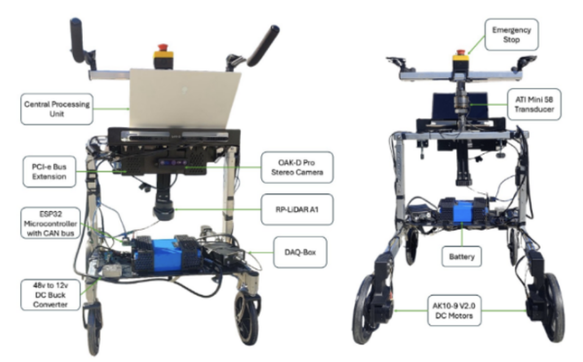
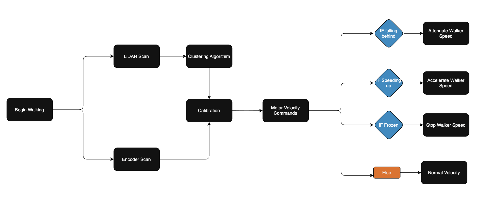
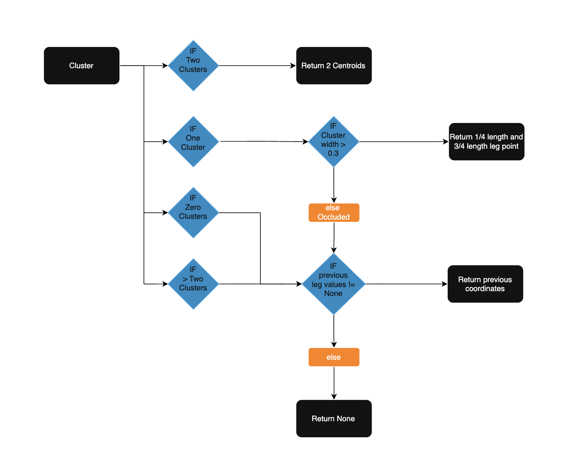
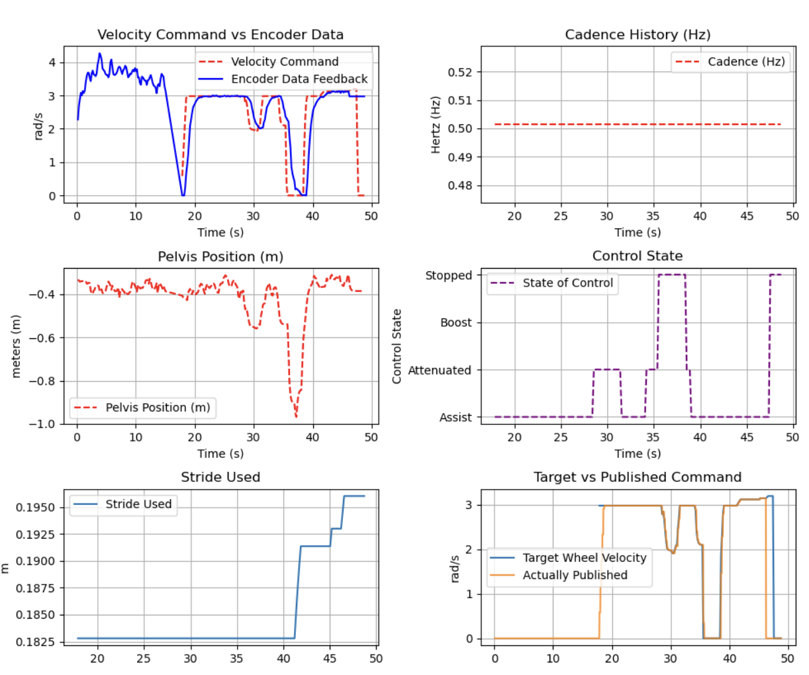

# Overview
The Smart Walker is an autonomous rehabilitation device used to help patients with dementia or other gait disabilities learn how to walk again. 

The current control system uses force torque sensors to measure conscious intent of the user during walking in order to walk with the patient without exerting much energy to move the walker. While this is useful, having a control system that only looks at the force being applied to the handles isn’t an accurate depiction of the user's actual intent since it’s not taking into account the users legs. In order to fix this problem with relatively cheap components, I've added a feed forward + feedback control system using a 2D RPLidar A1M8-R6 to perceive the users legs and an AK-10-9 V2.0 motor with magnetic encoders to control the wheels. 

# Objectives
1. Design a control system that can measure the users intent through a 2D LiDAR scan of the patients legs in order to command motor speeds in rhythm with the user.
2. Extract gait metrics from sessions i.e (Velocity, Stride Length and Time Variability, Gait Symmetry, Lateral Step Length)
3. Execute Proof of Concept on different gait patterns.

# How It Works
It's difficult to create a real time control system that uses only 2D LiDAR scans due to the low 10 Hz sampling rate, occlusion, and noise from outside LiDAR scans. Because of this, traditional frequency calculation methods like a Fast Fourier Transforms (FFT) has built in latency proportional to it's window size, and resolution is also inversely proportional to the latency shown in the equations below. For a control system that needs to walk in rhythm with a patient that has irregular pacing i.e (changes in stride length and step timing) delay motor control which can cause discomfort and potential injuries when walking. 
In order to solve this I implemented an Hopf Adaptive Frequency Oscillator (AFO) that uses a coupled set of differential equations that converges to the frequency of any input frequency over time. To make sure the input signal to the AFO doesn't have unpredictable noise and is filtered in real time I used a simple low pass filter. In order to make sure the patient is within a comfortable distance, I added an attenuation and freezing gait detection system in order to slow down, speed up, or stop, if the user is deviating from their normal gait. 

## ROS2 Topics and sensor inputs

### Publishers
* `/shutdown`: Unlocks Safety switch to turn on motors 
* `/right_wheel_velocity`: Commanded Right Wheel Velocity
* `/left_wheel_velocity`: Commanded Left Wheel Velocity

### Subscribers 
* `/scan_legs_fitlered`: (x,y) coordinates of LiDAR scans
* `/encoder_data`: Wheel Velocities

## Leg Detection

LiDAR scans are grouped using DBSCAN, a density based clustering algorithin that identifies groups of points as clusters. Using the centroid of each point, we define each leg as a single (x,y) point. 

(Add picture)

### Occlusion Detection
There can be instances where DBSCAN can't identify 2 distinct clusters due to noise or occlusion of one leg behind the other. Below is the decision tree based on different possible scenarios. 

### Hopf Adaptive Frequency Oscillator (AFO) 

The Hopf Adaptive Frequency Oscillator is a coupled set of differential equations shown below. As you run this equation over many time steps the input signal F(t) forces $\dot{\omega}$ to either speed up or slow down to match the frequency of the input signal. 

$$
\begin{aligned}
\ r     &= \sqrt{y^2 + x^2} \\
\dot{x} &= (\mu - r^2)x - y + \epsilon * F(t) \\
\dot{y} &= (\mu - r^2)y + x \\
\dot{\omega} &= \frac{\eta F(t) y}{r} \\
\omega  &= \dot{\omega} * dt + \omega
\end{aligned}
$$

https://github.com/user-attachments/assets/7dd72901-bb62-4123-a32d-af2526f6bd0f

[Simulation Code](/HardwareInTheLoop/AFO_simulation.py)

> [!NOTE]
> * $\eta$ - Changes the rate of convergence of the AFO frequency to the input signal frequency
> * $\epsilon$ - Changes sensitivity of $\dot{x}$ to the input signal
> * $\mu$ - Baseline radius with no input signal. Represents the amplitude of your AFO.  

### Scissor Metric
The input signal I chose was the difference in position of the left leg relative to the right. If we were to take the raw distance of each leg in terms of the walker we would have two different leg frequencies (Left and Right). This creates more complexity as we need to calculate when to use one leg frequency over the other and with a sampling rate of 6 Hz, it's common to miss heel strikes the moment they happen. In addition, this would create jittery and uncomfortable changes in velocity for the user. 

The scissor metric eliminates this by having an entire stride (Step length of Left and Right) in one oscillation, which embodies the overall frequency of the user. 

$$
\begin{aligned}
\ x_{signal} &= x_{left} - x_{right}
\end{aligned}
$$

### Calibration
Initial gait metrics of the user is needed to calibrate the necessary speed / frequency of their gait patterns. During this period the user pushes the walker themselves. Average standard deviation is calculated to ensure smooth walking during calibration and the below equation is used to calculate necessary gain to compensate for the difference in leg movement vs needed speed of the walker. 

$$
\begin{aligned}
\ gain &= EncoderVelocity / (cycle_frequency * cycle_stride)
\end{aligned}
$$

### Velocity Command
$$
\begin{aligned}
\ Velocity_{AFO} &= Frequency * Stride Length * Velocity Gain \\
\end{aligned}
$$

### Safety Features
Rate limiter was added to limit the maximum acceleration of wheel to ensure smooth motion. 

## Zone Calculation:
* Normal (0.60 < pelvis < 0.28): - If the user is in the desired zone, velocity will be normally calculated 
* Boost (0.28 < pelvis < 0):  - If the user is too close to the walker the velocity will increase
* Attenuation (0.60 < pelvis < 0.50): - If the user is too far from the walker the velocity will decrease 
* Frozen (0.75 < pelvis and frozen) - If the user freezes or is too far from the walker motor commands stop and reverse to a comfortable position.

# Validation
Convergence time for the AFO varies depending on gain tuning. In order to find the lowest convergence time for different initial average frequencies, I created a nested for loop with 20 different gains from (1,10) and an initial omega of 1Hz to calculate the lowest convergence time. I found that it's less important what gain values to choose, than your initial freqeuncy. 

For further details look into: [Adapative Frequency Oscillator Gain Validation Documentation](/Docs)

[Adapative Frequency Oscillator Gain Validation Code](/HardwareInTheLoop/AFO_validation.py)

# Commands
`cd ~/ros2_ws`
`ros2_load`
`ros2 launch rplidar_ros gait_lidar_launch.py`
`ros2_load`
`docker run -it --rm -v /dev:/dev --privleged --net=host microros/micro-ros-agen-jazzy serial --dev /dev/ttyUSB1 =b 115200`
`ros2_load`
`python3 ~/ros2_ws/src/control_system/control_system/AFO_control.py`
`

# Example Output
Calibration time: 14.833203554153442 s  
Mean Command: 2.453 rad/s  
Mean Encoder:      2.826 rad/s  
RMSE Predicted to True Velocity:       0.902 rad/s  
Mean error: -0.01763556725637624 --- Negative : missing low --- Positive : missing high ---  
Mean error absolute (MAE): 0.4707271453445335  
Standard Deviation of commanded velocity 1.0432527452144844  
Time in Active Assist: 70.43010752688173 %   
Time in Active Attenuation: 15.591397849462366 %  
Time in Boost: 0.0 %  
Time in 0 Velocity: 13.978494623655912 %  
Time detected Frozen Gait [35.55018329620361, 47.55037522315979]  

https://github.com/user-attachments/assets/790466eb-0060-42ea-8940-d9f74e1ff06b

### References

1. https://pubmed.ncbi.nlm.nih.gov/18728766/
2. https://www.sciencedirect.com/science/article/pii/S2405896325032136

